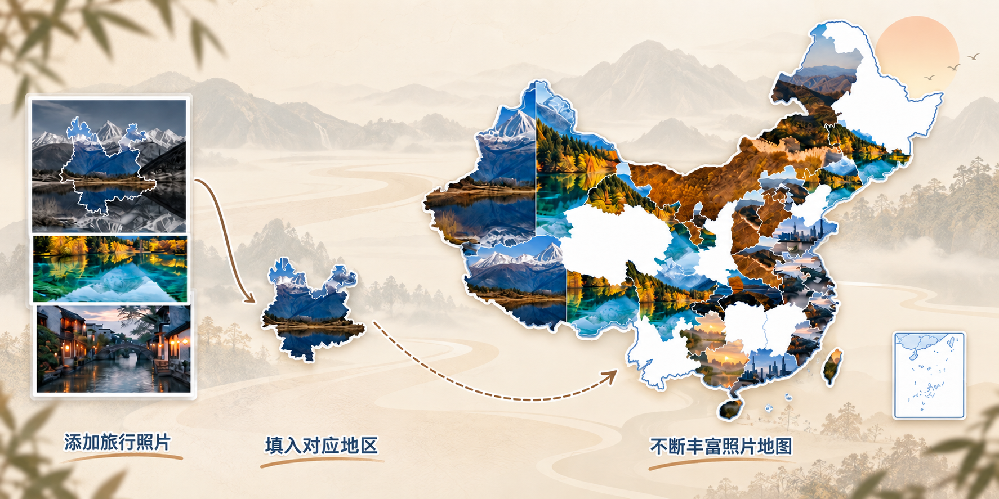
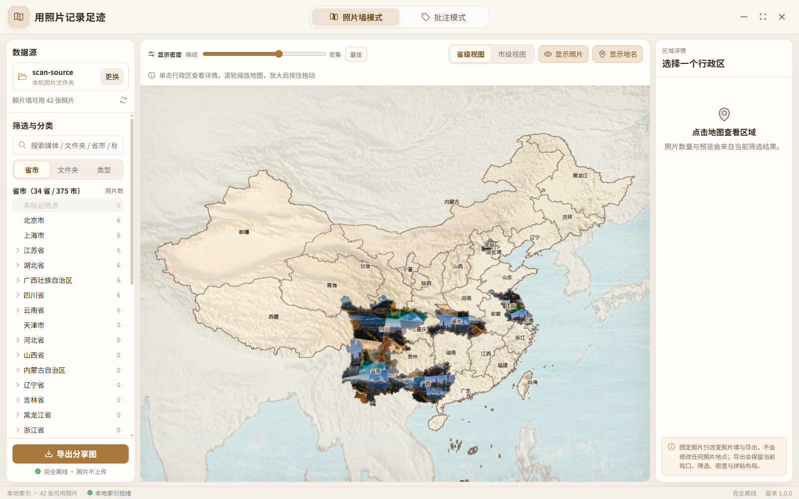
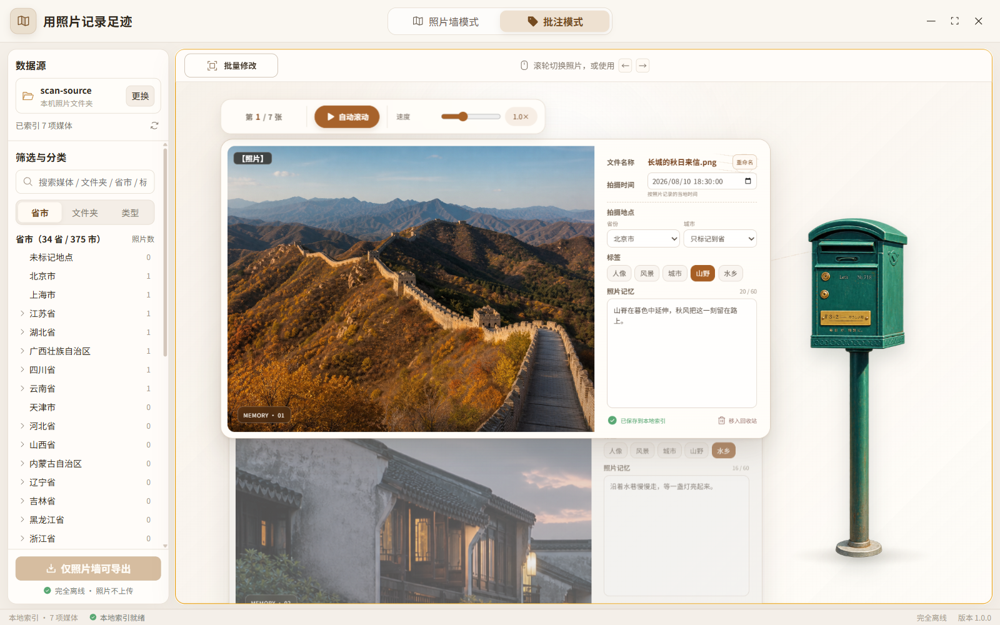
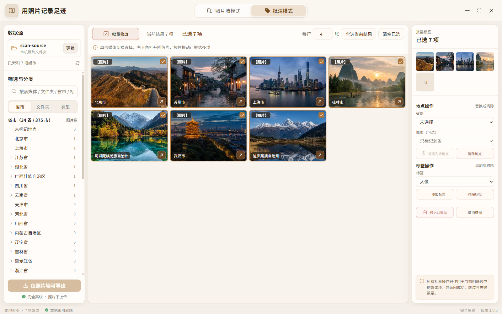
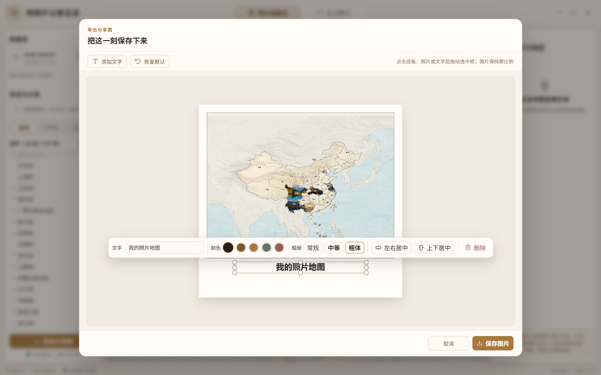
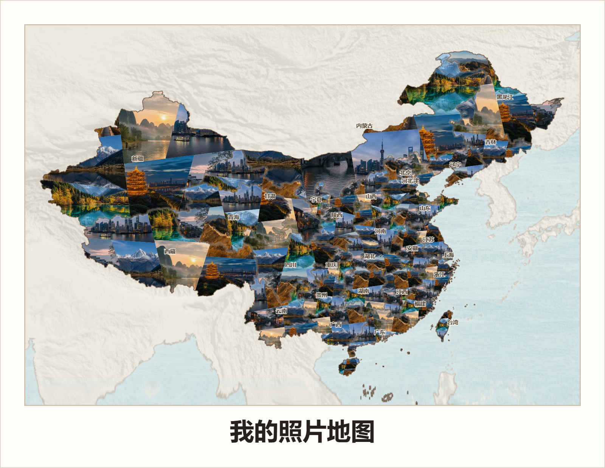

# 用照片拼地图 · PhotoMap

**把旅行照片，拼成属于你的中国地图。**



*照片地图成长过程示意，非软件截图或实际导出。*

**简体中文** · [English](README.en.md)

PhotoMap 按照片的地点，将旅行回忆拼入中国省、市轮廓，导出一张可以保存和分享的照片地图。

Windows 10 / 11 x64 · 离线桌面应用 · 无需账号 · 照片保存在本机

[选择使用方式](#使用方式) · [从源码构建](#从源码构建) · [拼出第一张地图](#拼出第一张地图) · [使用指南](docs/USAGE.md)

## 能做什么

### 照片墙：把旅行足迹拼进地图

为照片确认或补充拍摄省市后，照片会自动排布、裁切并填入对应的地图轮廓。每次旅行后，把新照片加入同一目录并刷新，就能让地图继续丰富。

左侧可以按地点、文件夹或类型筛选照片，上方可以切换省级 / 市级视图、调整拼图密度；点击地图上的地区，还能查看该地区的照片并固定喜欢的选片。



### 明信片：逐张回看，记下照片背后的故事

切换到 **「批注模式」**，以明信片的形式浏览照片。在照片右侧补充拍摄时间、地点和标签，或在 **「照片记忆」** 中写下当时的故事。

上方的 **「自动滚动」** 可以连续回看照片；这些批注和整理记录保存在本机，方便以后查找与回忆。



### 批量整理：一次标注多张旅行照片

在批注模式中开启 **「批量修改」**，从照片网格里选中多张照片，再用右侧面板统一替换或清除地点、添加或移除标签。

例如，先筛选出同一次云南旅行的照片，再一起标注「云南省」并添加旅行标签，省去逐张填写的重复操作。单张照片的故事仍在明信片中填写。



### 导出编辑：保存一张可以分享的旅行纪念图

在照片墙中点击 **「导出分享图」**，为当前地图添加标题，调整边框留白、整张地图与文字的位置和大小，也可以设置文字颜色与粗细。确认版式后点击 **「保存图片」**，即可导出不含操作控件的 PNG。

下图展示保存前的排版编辑界面；如果想更换地区选片或调整拼图密度，请先回到照片墙修改，再打开导出。



*以上四张为软件实际界面截图，使用 AI 合成照片与演示批注，不含私人照片。*

<details>
<summary>查看保存后的 PNG 成品示例</summary>

下面是通过应用导出的成品：34 个省级主体区块由多张照片拼满，搭配米白边框与「我的照片地图」标题。它展示的是保存后的图片，而上面的截图展示的是保存前的编辑界面；两者使用了不同的演示选片与拼图密度。



*使用项目合成照片与演示地点，不代表真实旅行记录。制作参数与素材来源见 [ASSETS.md](ASSETS.md)。*

</details>

## 使用方式

PhotoMap 有 **便携式** 和 **安装包** 两种使用方式，拼图、整理与导出功能相同。

| 使用方式 | 怎样开始 | 适合你，如果…… |
| --- | --- | --- |
| **便携式（免安装）** | 将完整应用文件夹放在可写位置，直接打开其中的 `PhotoMap.exe`；不能只复制 `.exe` | 希望自行放置应用文件夹，打开即可使用 |
| **安装包（安装后使用）** | 运行 `PhotoMap-Setup.exe`，完成安装后打开 PhotoMap | 希望像普通 Windows 软件一样安装使用 |

目前通过[源码构建](#从源码构建)获取这两种应用包。已有构建好的应用包时，可直接按上表使用，无需安装 Node.js 或运行 npm 命令。

## 开始前准备

- **准备地图**：两种应用包均不附带地图数据。请先按[地图获取与导入说明](docs/USAGE.md#地图数据)准备匹配的省、市两份文件，再在应用中导入，由软件检查是否兼容。无法取得匹配文件时，仍可浏览与整理照片，照片墙和 GPS 省市解析暂不可用。
- **准备照片**：第一次可以先选几张 JPG / PNG 试用。普通照片用于拼图，视频和实况照片支持浏览与整理；其他格式见[媒体兼容性](docs/USAGE.md#媒体兼容性)。
- **没有 GPS 也能用**：照片带 GPS 时，可以确认软件生成的省市建议；没有 GPS 时，手动或批量补充地点即可。两种情况都需要先导入地图，才能使用照片墙。

## 从源码构建

准备 **Node.js 24.15.0 或更高的 24.x 版本、npm 11.x**；生成安装包还需要 **PowerShell 7.2+**。本地构建不要求精确匹配补丁版本；CI 与正式发布使用固定的 Node.js 24.19.0、npm 11.12.1。在包含 `package.json` 的项目目录中打开 PowerShell，先安装依赖：

```powershell
npm ci
```

然后根据所选使用方式，执行以下一种命令：

| 想使用的版本 | 构建命令 | 构建后的操作 |
| --- | --- | --- |
| **便携式** | `npm run package` | 将 `out/PhotoMap-portable-win32-x64/` 整个文件夹复制到 `out/` 之外的可写位置，打开其中的 `PhotoMap.exe` |
| **安装包** | `npm run make` | 运行 `out/make/squirrel.windows/x64/PhotoMap-Setup.exe` 完成安装 |

`npm run make` 会同时生成安装包和便携版，**无需先运行 `npm run package`**。

安装依赖和首次下载运行环境需要网络；构建完成后，照片扫描、整理与导出在本机离线完成。

开发调试、再次打包与下载排障见[开发指南](docs/DEVELOPMENT.md#运行与打包)。

## 拼出第一张地图

先用一个小文件夹试一遍：例如，放入几张来自北京、上海或云南的普通照片，完成下面四步。

1. **导入地图**：在应用中点击“导入地图数据”，导入准备好的省、市两份文件。
2. **选择照片文件夹**：点击“选择照片文件夹”，选中刚才的小文件夹；应用会扫描该目录及其子文件夹。
3. **确认地点**：确认 GPS 生成的省市建议，或手动、批量补充实际拍摄地点。例如，为云南的照片标注“云南省”，即可用于省级照片墙。
4. **查看并导出**：切换“照片墙模式”，查看照片填入对应省份的效果；调整选片与版式，再点击“导出分享图”保存 PNG。

保存后，你会得到一张不含操作控件的照片地图。熟悉流程后，再选择自己的旅行照片目录继续整理；城市视图、批量标注等详细操作见[使用指南](docs/USAGE.md)。

## 数据与原文件

- 照片与整理记录保存在本机，没有云同步或遥测。
- 扫描和批注不修改源媒体；重命名会改动源文件名，删除会移入 Windows 回收站。导出请使用新文件名或单独的目录，避免覆盖原图。
- 便携版的整理记录保存在应用旁的 `PhotoMapData` 文件夹；安装版保存在当前 Windows 用户的数据目录。具体位置见[数据位置](docs/USAGE.md#数据位置)，源照片需另行备份。
- 分享便携版请使用未运行过的干净应用包；备份自己的便携版时，需保留 `PhotoMapData`。详见[分享与备份](docs/USAGE.md#便携版分享与备份)。

## 文档与贡献

- [使用指南](docs/USAGE.md)：地图导入、媒体格式、数据位置与隐私说明
- [开发指南](docs/DEVELOPMENT.md)：环境准备、打包、排障与测试
- [贡献指南](CONTRIBUTING.md) · [变更记录](CHANGELOG.md)
- [安全报告](SECURITY.md) · [行为准则](CODE_OF_CONDUCT.md)

## 许可证

项目源代码采用 [MIT](LICENSE)。素材与第三方组件的许可分别见 [ASSETS.md](ASSETS.md) 和 [THIRD_PARTY_NOTICES.md](THIRD_PARTY_NOTICES.md)。
